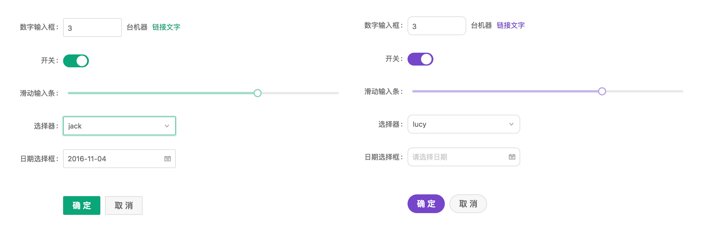
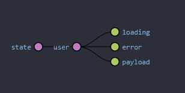
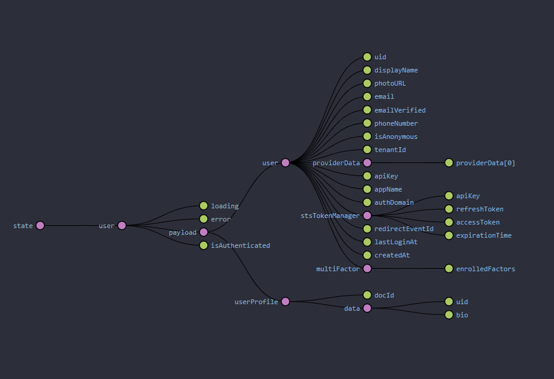

DEMO: https://fir-react-auth-35f83.firebaseapp.com/

# Motivation

When starting a new project it can be incredibly time consuming to reach the milestone that will finally let you start implementing your ideas, and doing actual work.

The goal of this project is to be just that, a solid modern project template that you can easily pick up on and not worry too much about the boilerplate.

- [Firebase Authentication](https://firebase.google.com/docs/auth)
- [Firebase Storage](https://firebase.google.com/docs/storage)
- [Firebase Firestore](https://firebase.google.com/docs/firestore)
- [Ant Design](https://ant.design)
- Redux
- Dockerfile

# Installation

## Option 1

### > **Docker**

To install it with docker, you only need to run the following command:

#### dev port 3000

```
docker-compose up -d --build
```

#### prod port 80

```
docker-compose -f docker-compose.prod.yaml up -d --build
```

## Option 2

### > **React**

```bash
# Install the node packages
npm install
# Start the App in Development Mode
npm start
```

# Configuration

Replace the environment variables from `.env` and enable authentication with email and password.

### bucket rules

```
rules_version = '2';
service firebase.storage {
  match /b/{bucket}/o {
    match /{allPaths=**} {
      allow read, write: if true;
    }
  }
}
```

database rules

```
rules_version = '2';
service cloud.firestore {
  match /databases/{database}/documents {
    match /{document=**} {
      allow read, write;
    }
  }
}
```

# Documentation

## Introduction

This documentation will assume a fair knowledge of React as well as some of the tools that we are used, including:

- [Ant Design](https://ant.design) as the UI webkit.
- [React Hooks](https://reactjs.org/docs/hooks-intro.html)
- [React Redux](https://redux.js.org/basics/usage-with-react)

## Routes

The App.js component ([App.js](./react/src/App.js)) is being used as the main router and it is here that the main routes are defined. If you want to define other routes in your sub-components, you should not use `<Router>` again.

## Customization - Antd Theming


ANTD is using Less as the development language for styling. A set of less variables are defined for each design aspect that can be customized to your needs.
There are some major variables below, all less variables could be found in [Default Variables](https://github.com/ant-design/ant-design/blob/master/components/style/themes/default.less).

Your custom changes should go in `craco.config.js`.

For all of the potential customizations don't hesitate to check [their documentation](https://ant.design/docs/react/customize-theme) which covers them all.

## Layout Component

Layout Component ([Layout.js](./react/src/containers/Layout.js))

In this template the layout component is to be used to display the main content of the webpage.

## Navbar

To **add more links** you can just add more `Menu.Item` under `Menu` and make sure that the `Link` `to` is the same as the `Menu.Item` `key` without the `/` at the end, otherwise it won't show as selected, you can look at how this was done for the existing ones.

> Tip: make sure that the `Menu.Item` is not nested in any other component and that it goes right under `Menu`.

## Sessions

The session is managed by the [Redux](https://redux.js.org/basics/usage-with-react) store.

When the page is loaded, an action `actions.autoLogIn()` is dispatched, from [App.js](./react/src/App.js), to the [store actions](./react/src/store/actions/user.js) which just checks for the existence of a token in localStorage and if there is no token in localStorage it logs the user out, otherwise it checks the token's validity and dispatches some other actions [check `autoLogIn()`](./react/src/store/actions/user.js) to see the code.

When the user is not logged in the store looks the following:



When the user is logged in the store looks the following:



> Note: To visualize the above you need to get the [Redux DevTools Extension](https://github.com/zalmoxisus/redux-devtools-extension).

- user
  - loading - is a boolean that can used, for example, in the conditional rendering of elements, this is used in [Login](./react/src/components/Login.js) and [My Profile](./react/src/components/MyProfile/index.js).
  - error - is a boolen, that can be used, for example, to set a given element to show that it errored out, such as an icon.
  - email - note that email is moved inside profile once the user has logged in.

## Custom user profile

By default when a user is registered a document is created with his uid.
You can add as many custom attributes as you wish.
user.js

```jsx
try {
  firestore.collection("userProfile").doc(data.docId).set(
    {
      // CUSTOM PROFILE
      bio: data.bio,
    },
    { merge: true }
  );
} catch {}
```

## My Profile

My Profile ([MyProfile/index.js](./react/src/components/MyProfile/index.js))

More options will be added in the future, these existing ones are just a proof of concept or example.

## Notifications

Notifications ([notificationHelpers.js](./react/src/Helpers/notificationHelpers.js))

The current notification system is based on the [Ant Design notifications](https://ant.design/components/notification/) and it is implemented as a callback for actions that are dispatched to the store, this callback is optional but it is currently the way to run a notification when the axios request returns its promise.

A good example of how to use these notifications can be seen in `Basic.js`.

> [Login.js](./react/src/components/Login.js)

```jsx
import { runNotifications } from "../helpers/Notification";
// ...
// Inside the component:

const onFinishModals = (values) => {
  props.forgottenPassword(values.forgottenEmail, runNotifications);
};
// ...
const mapDispatchToProps = (dispatch) => {
  return {
    // map the callback just like a regular argument, in whatever action you want to dispatch
    signInUser: (email, password, callback) =>
      dispatch(actions.signInUser(email, password, callback)),
  };
};
// ...
```

> [user.js](./react/src/store/actions/user.js)

```jsx
// ...
// when you define your action make sure to define an empty anonymous function as the
// default function in case you don't want to call notifications on the given action
export const forgottenPassword = (email, notificationCallback) => (
  dispatch
) => {
  auth
    .sendPasswordResetEmail(email)
    .then((res) => {
      notificationCallback(
        `Thanks! Please check ${email} for a link to reset your password.`,
        "SUCCESS"
      );
    })
    .catch((error) => {
      notificationCallback(error.message, "ERROR");
    });
};
// ...
```
